  <picture>
    <source
      media="(prefers-color-scheme: dark)"
      srcset="./assets/ascii-portrait-dark.svg"
    />
    <source
      media="(prefers-color-scheme: light)"
      srcset="./assets/ascii-portrait-light.svg"
    />
    
  </picture>

# Hey, I'm Tyler 👋

### Software Engineer · Computer Science @ CCNY

**Full Stack · Systems · AI · Data Engineering**

🏆 HackHarvard Winner · 🥉 EasyA x Algorand Harvard · 💻 Always Building

 

 

  
  &nbsp;&nbsp;
  

---

## 🚀 About Me

- 💻 I build software from idea to deployment across full-stack, systems, AI, and data-focused projects.
- 🧠 I enjoy understanding how technologies work beneath the surface, not just how to use them.
- 🏆 I won **Best Use of the Gemini API at HackHarvard** for building HaloAudit.
- 🥉 I placed **third at EasyA x Algorand Harvard** with metaCAMPUS.
- 🌱 I am currently exploring distributed systems, cloud infrastructure, native development, AI, and computer graphics.
- 🤝 I am open to internships, hackathons, open-source contributions, collaborations, and ambitious projects.
- ♟️ Outside of technology, I enjoy the gym, chess, and music.

---

## 🛠️ Tech Stack

### Languages

  
  &nbsp;
  
  &nbsp;
  
  &nbsp;
  
  &nbsp;
  
  &nbsp;
  

### Frontend and Backend

  
  &nbsp;
  
  &nbsp;
  
  &nbsp;
  
  &nbsp;
  
  &nbsp;
  

### Databases and Tools

  
  &nbsp;
  
  &nbsp;
  
  &nbsp;
  
  &nbsp;
  
  &nbsp;
  

---

## ⭐ Featured Projects

<table>
  <tr>
    <td width="50%" valign="top">
      <h3>🤖 HaloAudit</h3>
      

        HackHarvard-winning AI audit assistant that analyzes files and produces structured reports using Gemini.
      

      

        <strong>Stack:</strong> Electron, React, TypeScript, Gemini, Cloudflare Workers, D1, R2
      

    </td>
    <td width="50%" valign="top">
      <h3>🛒 Pricetunity</h3>
      

        AI-powered product discovery platform with product ranking, review sentiment analysis, and intelligent recommendations.
      

      

        <strong>Stack:</strong> React, TypeScript, Flask, PostgreSQL, SQLAlchemy, Gemini
      

    </td>
  </tr>
  <tr>
    <td width="50%" valign="top">
      <h3>📂 BulkRenamer</h3>
      

        Native Windows desktop application for rapidly renaming large groups of files through a custom graphical interface.
      

      

        <strong>Stack:</strong> C++, Win32, OpenGL, GLFW, ImGui, GLM, Boost
      

    </td>
    <td width="50%" valign="top">
      <h3>📊 Outbreak.io</h3>
      

        Mobile application that combines environmental and public-health data to help users understand local conditions.
      

      

        <strong>Stack:</strong> React Native, Expo, Node.js, Express, MongoDB
      

    </td>
  </tr>
  <tr>
    <td width="50%" valign="top">
      <h3>🌐 metaCAMPUS</h3>
      

        Third-place EasyA x Algorand Harvard project focused on creating a blockchain-powered campus ecosystem.
      

      

        <strong>Stack:</strong> Next.js, TypeScript, Tailwind CSS, PyTeal, Algorand
      

    </td>
    <td width="50%" valign="top">
      <h3>🌉 LayerZero OFT Bridge</h3>
      

        Cross-chain fungible token bridge demonstrating deployment, peer wiring, minting, and token transfers between networks.
      

      

        <strong>Stack:</strong> Solidity, Hardhat, TypeScript, Ethers.js, LayerZero V2
      

    </td>
  </tr>
</table>

---

## 🏆 GitHub Achievements

  

---

## 🐍 Contribution Activity

  <picture>
    <source
      media="(prefers-color-scheme: dark)"
      srcset="./assets/github-snake-dark.svg"
    />
    <source
      media="(prefers-color-scheme: light)"
      srcset="./assets/github-snake.svg"
    />
    
  </picture>

---

## 🏅 Highlights

<table>
  <tr>
    <td>🏆</td>
    <td><strong>HackHarvard Winner</strong></td>
    <td>Best Use of the Gemini API for HaloAudit</td>
  </tr>
  <tr>
    <td>🥉</td>
    <td><strong>EasyA x Algorand Harvard</strong></td>
    <td>Third place for metaCAMPUS</td>
  </tr>
  <tr>
    <td>🎓</td>
    <td><strong>Computer Science</strong></td>
    <td>The City College of New York</td>
  </tr>
  <tr>
    <td>💼</td>
    <td><strong>Software Engineering</strong></td>
    <td>Full-stack, systems, AI, data, and native development</td>
  </tr>
</table>

---

## 🌐 Connect With Me

  
  &nbsp;&nbsp;
  

  <strong>If you're building something interesting, let's connect. 🤝</strong>

